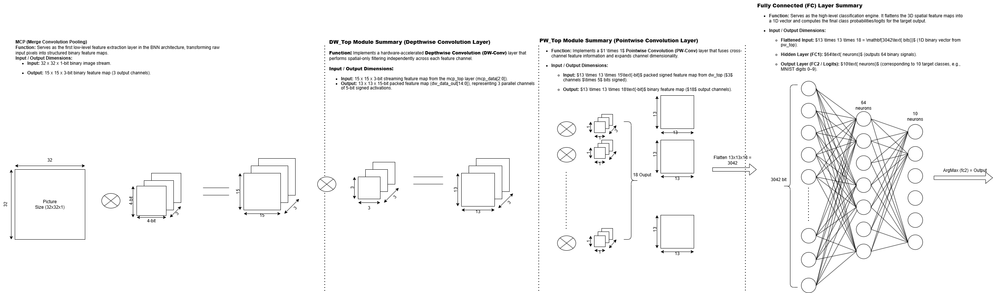

# BNN Accelerator RTL

SystemVerilog RTL implementation of a Binary Neural Network (BNN) accelerator.

The architecture includes binary computation blocks such as MCP, Depthwise Convolution, Pointwise Convolution, and Fully Connected layers.

## Demo Video

https://youtu.be/yjFJClScT_E?si=Cu_fumCJRkjND2Jz


## Architecture

<p align="center">
  
</p>

## Main Layers

| Layer | Function |
|---|---|
| MCP | Performs binary computation using XNOR, Popcount, and Threshold |
| DW | Depthwise convolution for spatial feature extraction on each channel |
| PW | Pointwise convolution for channel mixing and channel expansion |
| FC | Fully connected layer for final classification |

## BNN Computation

In the BNN, conventional multiplication is replaced by binary operations:

```text
Input Activation
      │
      ▼
     XNOR  ◄── Binary Weight
      │
      ▼
   Popcount
      │
      ▼
 Threshold
      │
      ▼
 Binary Output